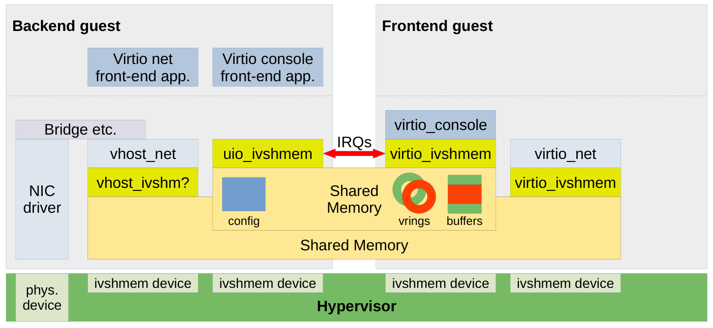

# ivshmem虚拟设备通信原理

本篇主要讲解ivshmem虚拟设备后端与前端利用共享内存和中断进行通信的原理及过程分析。

上图中左侧为OEE侧，右侧为RTOS，通信过程主要通过中断及共享内存实现，中断处理及共享内存的初始化部分由ivshmem pcie驱动完成，本文后续内容建立在中断可互相通知，共享内存可直接使用的基础上。

后续内容中`device`端也是指OEE，`driver`端是指RTOS。

# 一、virtio_ring 结构体介绍
```c
#include <openamp/virtio_ring.h>
/**
 * @brief The virtqueue layout structure
 *
 * Each virtqueue consists of; descriptor table, available ring, used ring,
 * where each part is physically contiguous in guest memory.
 * 
 * 每个virtqueue包含：描述符环、可用环、已用环，每个部分在共享内存中是连续的。
 *
 * When the driver wants to send a buffer to the device, it fills in a slot in
 * the descriptor table (or chains several together), and writes the descriptor
 * index into the available ring. It then notifies the device. When the device
 * has finished a buffer, it writes the descriptor index into the used ring,
 * and sends an interrupt.
 * 
 * 当驱动端想要发送一个消息到设备端时，它会填充描述符环里的一个（或将几个链接在一起），并写入可用环的索引。
 * 然后会发送中断通知设备端。当设备完成接收消息后，它会将收到的描述符索引写入已使用的环中，并发送中断通知驱动端。  
 *
 * The standard layout for the ring is a continuous chunk of memory which
 * looks like this.  We assume num is a power of 2.
 * vring在共享内存中的数据排列如下：
 * struct vring {
 *      // The actual descriptors (16 bytes each)
 *      struct vring_desc desc[num];
 *
 *      // A ring of available descriptor heads with free-running index.
 *      __u16 avail_flags;
 *      __u16 avail_idx;
 *      __u16 available[num];
 *      __u16 used_event_idx;
 *
 *      // Padding to the next align boundary.
 *      char pad[];
 *
 *      // A ring of used descriptor heads with free-running index.
 *      __u16 used_flags;
 *      __u16 used_idx;
 *      struct vring_used_elem used[num];
 *      __u16 avail_event_idx;
 * };
 *
 * NOTE: for VirtIO PCI, align is 4096.
 */
struct vring {
	/**
	 * The maximum number of buffer descriptors in the virtqueue.
	 * The value is always a power of 2.
	 */
	unsigned int num;//描述符数量，可以理解为最大共享内存可容纳的消息数量

	/** The actual buffer descriptors, 16 bytes each */
	struct vring_desc *desc;//指向共享内存中num个消息，描述符环

	/** A ring of available descriptor heads with free-running index */
	struct vring_avail *avail;//可用描述符环,驱动端写,设备端读

	/** A ring of used descriptor heads with free-running index */
	struct vring_used *used;//已用描述符环,设备端写,驱动端读
};
```
`struct vring`是实际通信过程中控制数据传输的一个数据结构，后端前端的数据通信都由该数据结构实现。
其中三个指针在初始化时都会指向共享内存区域。
```c
/**
 * @brief VirtIO ring descriptors.
 *
 * The descriptor table refers to the buffers the driver is using for the
 * device. addr is a physical address, and the buffers can be chained via \ref next.
 * Each descriptor describes a buffer which is read-only for the device
 * (“device-readable”) or write-only for the device (“device-writable”), but a
 * chain of descriptors can contain both device-readable and device-writable
 * buffers.
 */
METAL_PACKED_BEGIN
struct vring_desc {
	/** Address (guest-physical) */
	uint64_t addr;//实际消息地址，在共享内存中

	/** Length */
	uint32_t len;//实际消息长度

	/** Flags relevant to the descriptors */
	uint16_t flags;

	/** We chain unused descriptors via this, too */
	uint16_t next;//0->1,1->2,环形索引
} METAL_PACKED_END;
```

```c
/**
 * @brief Used to offer buffers to the device.
 *
 * Each ring entry refers to the head of a descriptor chain. It is only
 * written by the driver and read by the device.
 */
METAL_PACKED_BEGIN
struct vring_avail {
	/** Flag which determines whether device notifications are required */
	uint16_t flags;

	/**
	 * Indicates where the driver puts the next descriptor entry in the
	 * ring (modulo the queue size)
	 */
	uint16_t idx;//driver写入下一个描述符索引

	/** The ring of descriptors */
	uint16_t ring[0];//描述符索引数组
} METAL_PACKED_END;
```

```c
/* uint32_t is used here for ids for padding reasons. */
METAL_PACKED_BEGIN
struct vring_used_elem {
	union {
		uint16_t event;
		/* Index of start of used descriptor chain. */
		uint32_t id;
	};
	/* Total length of the descriptor chain which was written to. */
	uint32_t len;
} METAL_PACKED_END;
/**
 * @brief The device returns buffers to this structure when done with them
 *
 * The structure is only written to by the device, and read by the driver.
 */
METAL_PACKED_BEGIN
struct vring_used {
	/** Flag which determines whether device notifications are required */
	uint16_t flags;

	/**
	 * Indicates where the driver puts the next descriptor entry in the
	 * ring (modulo the queue size)
	 */
	uint16_t idx;//device写入下一个描述符索引

	/** The ring of descriptors */
	struct vring_used_elem ring[0];
} METAL_PACKED_END;
```
vring初始化代码：
```c
static inline void
vring_init(struct vring *vr, unsigned int num, uint8_t *p, unsigned long align)
{
	vr->num = num;
	vr->desc = (struct vring_desc *)p;//传入共享内存起始地址
	vr->avail = (struct vring_avail *)(p + num * sizeof(struct vring_desc));//描述符的结束地址
	vr->used = (struct vring_used *)
	    (((unsigned long)&vr->avail->ring[num] + sizeof(uint16_t) +
	      align - 1) & ~(align - 1));//avail结束地址+对齐偏移
}
```

# 二、virtio_ring 通信流程
## 1. 驱动端发送消息
### 1.1 填入消息内容
```c
//当前空闲的描述符索引
u16 desc_index;
//获取空闲的描述符指针
struct vring_desc *curr_desc = vring.desc[desc_index];
//填入的地址为相对共享内存地址的偏移量，每个索引的描述符对应的地址可自行规定确认方式
//后续传输的数据即放在共享内存的此块内存
curr_desc->addr = OFFSET_SHMEM + MSG_LENGTH * desc_index;
//传输数据的长度
curr_desc->len = msg_len;
//0为消息的最后一个描述符，1为后续还有消息描述符
curr_desc->flags = 0;
//填入消息内容
memcpy(shmem + curr_desc->addr, msg_buff, msg_len);
```
### 1.2 发送消息
以下所有索引相关的变量都有取余描述符数量的操作，后续不作单独说明
```c
//当前可用索引指向刚刚填入的消息索引
vring.avail->ring[vring.avail->idx] = desc_index;
//空闲描述符索引更新，N为上一步传输的消息个数
desc_index += N;
//可用索引更新
vring.avail->idx++;
//中断通知
ivshmem_notify();
```
## 2. 设备端接收消息
```c
//接收中断通知
waitfor_notify();
//当前可用描述符索引
u16 avail_index;
//可用描述符索引未更新，说明没有新消息
if(avail_index == vring.avail->idx)
	return;
//获取消息描述符索引
u16 desc_index = vring.avail->ring[avail_index];
//获取消息描述符
get:
struct vring_desc *curr_desc = vring.desc[desc_index];
//读取消息内容
memcpy(msg_buff, shmem + curr_desc->addr, curr_desc->len);
//后续是否还有消息
if(curr_desc->flags != 0)
{
	desc_index++;
	goto get;
}
```
## 3. 设备端发送回复
```c
//更新已用内容
vring.used->ring[vring.used->idx].id = desc_index;
vring.used->ring[vring.used->idx].len = curr_desc->len;
avail_index++;
vring.used->idx++;
//中断通知
ivshmem_notify();
```
## 4. 驱动端接收回复
```c
//接收中断通知
waitfor_notify();
//当前已用描述符索引
u16 used_index;
//已用描述符索引未更新，说明没有回复内容
if(used_index == vring.used->idx)
	return;
//获取回复内容
u16 id = vring.used->ring[used_index].id;
u16 len = vring.used->ring[used_index].len;
used_index++;
```
# 三、两端初始化 virtio_ring

以下结构体为linux端通用，在**共享内存中存放于起始地址**。
```c
struct virtio_ivshmem_common_header {
	uint32_t revision;
	uint32_t size;

	uint32_t write_transaction;// 更新偏移量

	uint32_t device_features;
	uint32_t device_features_sel;
	uint32_t driver_features;
	uint32_t driver_features_sel;

	uint32_t queue_sel;//vring index

	uint16_t queue_size;//vring.num
	uint16_t queue_device_vector;
	uint16_t queue_driver_vector;
	uint16_t queue_enable;
	uint64_t queue_desc; //vring.desc
	uint64_t queue_driver;//vring.avail
	uint64_t queue_device;//vring.used

	uint8_t config_event;
	uint8_t queue_event;
	uint8_t __reserved[2];
	uint32_t device_status;//设为0xf后即为初始化完成

	uint32_t config_generation;
};
```
以下程序为linux端虚拟串口后端应用中的初始化部分，利用该结构体即可将RTOS端初始化好的vring的参数传递给linux端：
```c
static int process_write_transaction(void)
{
	unsigned int new_queue;

	switch (vc->write_transaction) {
	case 0:
		return 0;
	case VI_REG_OFFSET(device_features_sel):
		printf("device_features_sel: %d\n", vc->device_features_sel);
		if (vc->device_features_sel == 1) {
			vc->device_features =
				(1 << (VIRTIO_F_VERSION_1 - 32)) |
				(1 << (VIRTIO_F_IOMMU_PLATFORM - 32)) |
				(1 << (VIRTIO_F_ORDER_PLATFORM - 32));
		} else {
			vc->device_features = 1 << VIRTIO_CONSOLE_F_SIZE;
		}
		break;
	case VI_REG_OFFSET(driver_features_sel):
		printf("driver_features_sel: %d\n", vc->driver_features_sel);
		break;
	case VI_REG_OFFSET(driver_features):
		printf("driver_features[%d]: 0x%x\n", vc->driver_features_sel,
		       vc->driver_features);
		break;
	case VI_REG_OFFSET(queue_sel):
		new_queue = vc->queue_sel;
		printf("queue_sel: %d\n", new_queue);
		if (new_queue > 1)
			break;

		if (current_queue >= 0)
			memcpy(&queue_config[current_queue], &vc->queue_config,
			    sizeof(struct virtio_queue_config));

		current_queue = new_queue;
		memcpy(&vc->queue_config, &queue_config[current_queue],
		       sizeof(struct virtio_queue_config));
		break;
	case VI_REG_OFFSET(queue_config.size):
		printf("queue size: %d\n", vc->queue_config.size);
		break;
	case VI_REG_OFFSET(queue_config.driver_vector):
		printf("queue driver vector: %d\n",
		       vc->queue_config.driver_vector);
		break;
	case VI_REG_OFFSET(queue_config.enable):
		printf("queue enable: %d\n", vc->queue_config.enable);
		if (current_queue >= 0 && vc->queue_config.enable) {
			memcpy(&queue_config[current_queue], &vc->queue_config,
			    sizeof(struct virtio_queue_config));
			vring[current_queue].num = vc->queue_config.size;
			vring[current_queue].desc =
				shmem + vc->queue_config.desc;
			vring[current_queue].avail =
				shmem + vc->queue_config.driver;
			vring[current_queue].used =
				shmem + vc->queue_config.device;
			next_idx[current_queue] = 0;
		}
		break;
	case VI_REG_OFFSET(queue_config.desc):
		printf("queue desc: 0x%llx\n",
		       (unsigned long long)vc->queue_config.desc);
		break;
	case VI_REG_OFFSET(queue_config.driver):
		printf("queue driver: 0x%llx\n",
		       (unsigned long long)vc->queue_config.driver);
		break;
	case VI_REG_OFFSET(queue_config.device):
		printf("queue device: 0x%llx\n",
		       (unsigned long long)vc->queue_config.device);
		break;
	case VI_REG_OFFSET(device_status):
		printf("device_status: 0x%x\n", vc->device_status);
		if (vc->device_status == 0xf) {
			vc->config_event = 1;
			__sync_synchronize();
			mmio_write32(&regs->doorbell, peer_id << 16);
		}
		break;
	default:
		printf("unknown write transaction for %x\n",
		       vc->write_transaction);
		break;
	}

	__sync_synchronize();
	vc->write_transaction = 0;

	return 1;
}

//device端主程序循环
while (state[peer_id] == VIRTIO_STATE_READY) {
			event = process_write_transaction();

			if (vc->device_status == 0xf) {
				event |= process_rx_queue();
				event |= process_tx_queue();
			}

			if (!event) {
				ret = poll(pollfd, 2, -1);
				if (ret < 0)
					error(1, errno, "poll failed");
				if (pollfd[1].revents & POLLIN)
					wait_for_interrupt(regs);
			}
		}
```
# 四、共享内存数据排列

虚拟串口为例

| 地址  | 数据                           | 功能           |
| :-: | ---------------------------- | ------------ |
| 低地址 | struct virtio_ivshmem_header | 用于配置初始化及参数同步 |
|     | vring[0]                     | 用于数据发送       |
|     | vring[1]                     | 用于数据接收       |
| 高地址 | 后续地址可用于vring描述符消息数据存储        | 用于实际数据存放     |

# 五、参考资料
1. https://kvm-forum.qemu.org/2019/KVM-Forum19_ivshmem2.pdf
2. [深入浅出vhostuser传输模型 | REXROCK](https://rexrock.github.io/post/vhu1/)
